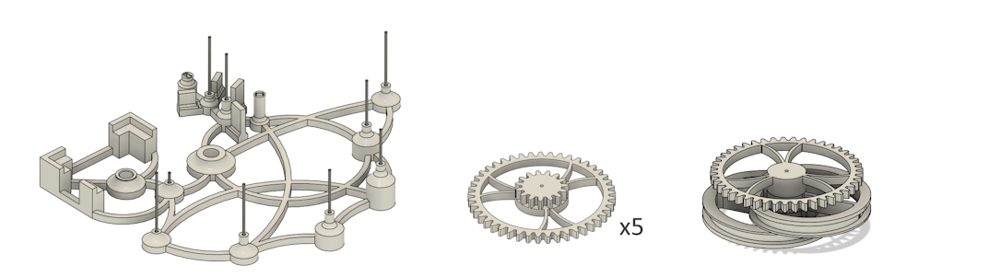

## Assemble the gears onto the frame

- Assemble the first four gears on the annual chain
- Fifth gear and cam assembly have to be applied together - I recommend watching the video for this one
- Final assembly for this stage as photo below

