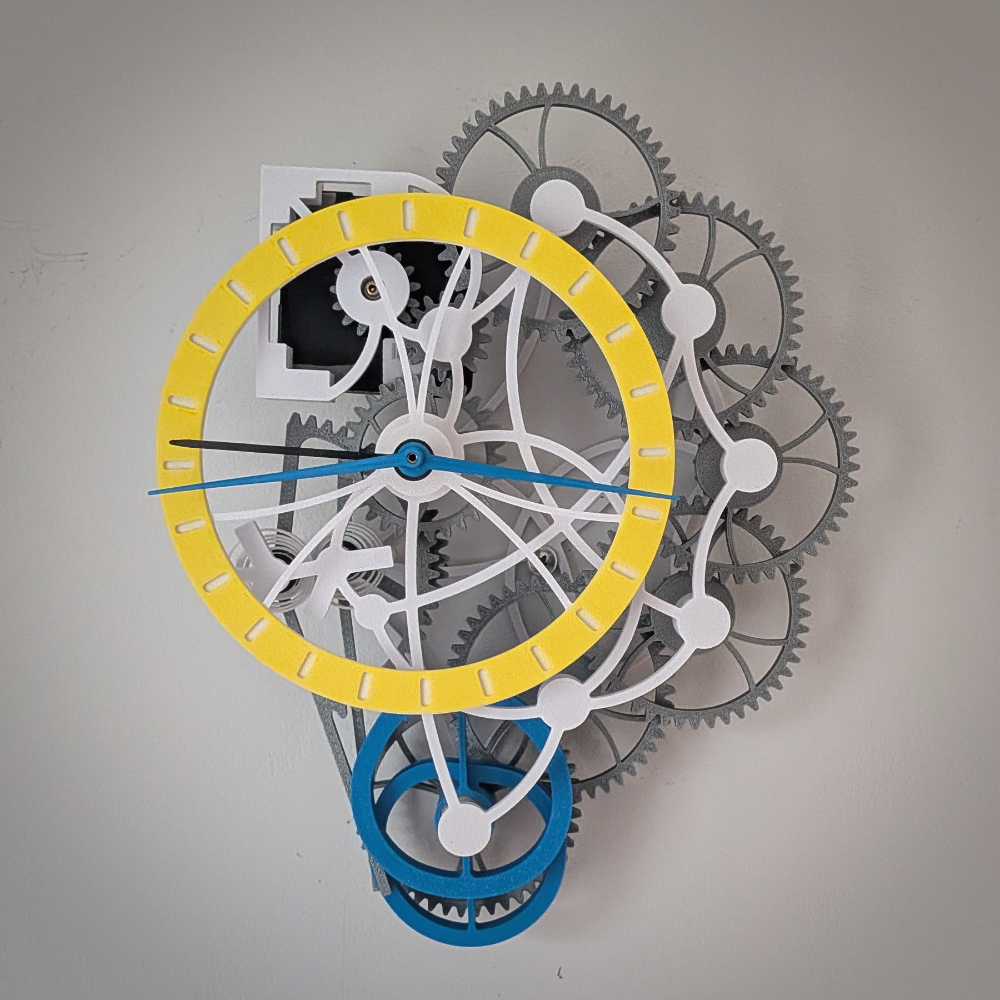

In this step we set the hour hand to the correct time, add the idler gear, and add the quartz component to fix the mechanism in place.

- Add double-sided tape in the correct position of the clock mechanism (shown in image below). Apply to the areas that will touch the mechanism holder part of the frame.
- Adjust the hour hand so that it points approximately to the right time, and slide in the idler gear onto its pin. 
- Once the idler gear is in place, you can let go of the hour hand and just turn the idler gear to get the hour hand back into the correct position.
- Holding the idler gear in place to stop it falling off it's short steel pin, press the clock mechanism into its housing, trapping the entire mechanism in place. Press and hold on the sticky tape for 30 seconds to fix the mechanism strongly in place.
- Manual adjustment: Hold the clock upright. Due to gravity, the hands will rest in their natural position. If the hour hand is not quite right, adjust it by gripping the brass shaft with pliers and changing the position of the hand.
- Put in the battery straight away - the mechanism should start ticking. Everything is now in place.

